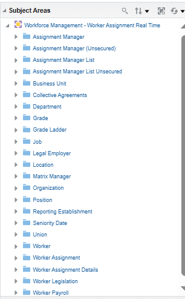
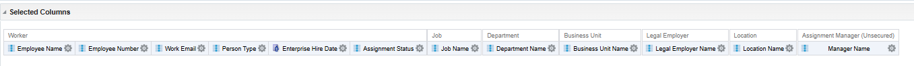
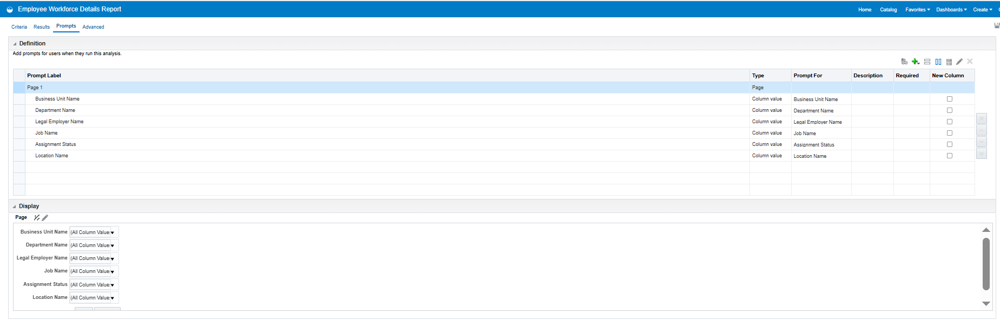
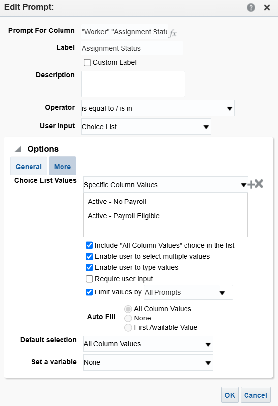
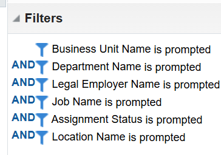
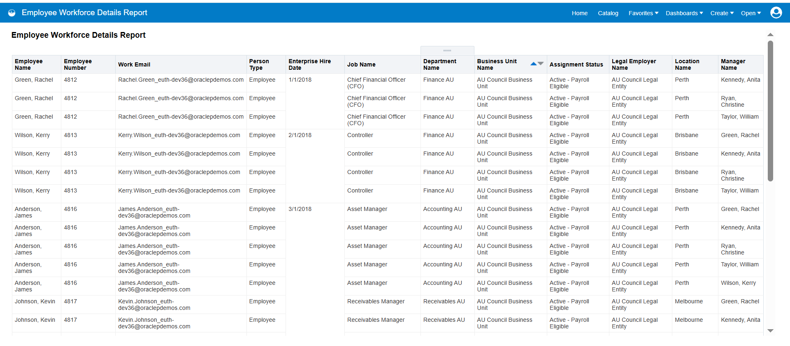

# OTBI – Employee Workforce Details Report

## 📊 Overview

**Employee Workforce Details Report** is an Oracle Fusion OTBI report created to provide HR users with current employee and employment information.

The report allows users to view, filter, search, and sort employee information based on key organizational attributes.

## 🎯 Business Requirement

Provide HR users with the current employee population and basic employment information with filtering capabilities.

## 🛠️ OTBI Configuration

**Subject Area:**
Workforce Management – Worker Assignment Real Time

**Report Type:**
Table View

### Report Columns

* Employee Number
* Employee Name
* Work Email
* Person Type
* Hire Date
* Assignment Status
* Job
* Department
* Business Unit
* Legal Employer
* Location
* Manager Name

### Filters & Prompts

* Business Unit
* Department
* Legal Employer
* Job
* Assignment Status
* Location

### Active Employee Assignment

The report displays only active employee assignments:

* Active – Payroll Eligible
* Active – No Payroll

## 🔐 Security

The following roles were assigned for **data access**:

* HR Specialist View All
* HR Manager View All
* HR Analyst View All

Data roles were refreshed after the role configuration.

## 📁 Repository Contents

* **OTBI Catalog File** – Report catalog export
* **Excel File** – Report output

---
## 📊 Employee Workforce Details Report
## 📸 Screenshots

## 1️⃣ Subject Area

## 2️⃣ Selected Columns

## 3️⃣ Prompts

## 4️⃣ Active Assignment Prompt

## 5️⃣ Filters

## 6️⃣ Report Output

